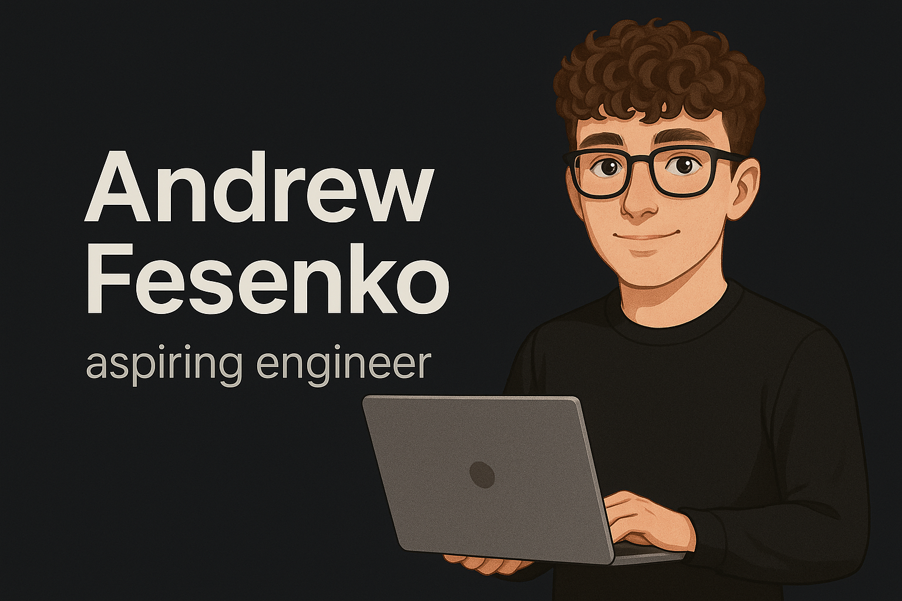

# Hi, I'm Andrew

  

## About Me

I'm a third-year **Computer Engineering** student at the **University of Florida**, passionate about building meaningful software, diving into **machine learning**, and working on hands-on **embedded systems** projects.

- Currently learning **AWS**, cloud architecture, Docker, and CI/CD workflows.
- Open to collaboration on **student projects**, **startups**, and **open-source** work.
- Always eager to learn and grow through real-world challenges and shared experiences.
- Fun fact: I'm **Ukrainian**, play piano (and a little guitar), and I enjoy listening to **Polyphia**.
- My personal website is coming soon — stay tuned!

## What I'm Up To

- Working on a mobile app called **Day Zero**

## Socials

## 💻 Tech Stack

### 🧑‍💻 Languages  
              

---

### 📦 Frameworks / Libraries  
                

---

### ☁️ Hosting / SaaS  
    

---

### 🗃️ Databases  
  

---

### 🤖 Machine Learning / AI  
            
