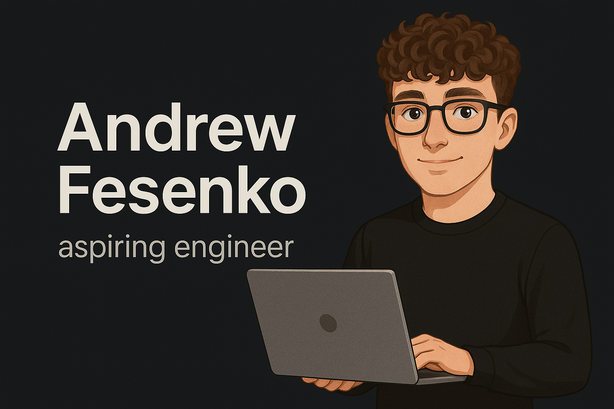

# Hi, I'm Andrew 👋🏻 💻
🔗 https://afesenko.com  
📧 andrewfesenko10@gmail.com

  

## 💼 About Me

I'm a third-year Computer Engineering student at the University of Florida, passionate about building meaningful software, diving into machine learning, robotics, embedded systems, and intelligent hardware software integration. I enjoy building systems that connect sensing, control, and machine learning into real world devices.

- Currently building Scouty, an autonomous mobile robotics platform
- Open to collaboration on student projects, startups, and open-source work.
- Always eager to learn and grow through real-world challenges and shared experiences.
- Fun fact: I'm Ukrainian, play piano (and a little guitar), and I’m into artists like Polyphia and Tyler, The Creator.

## 🚀 What I'm Up To

### Scouty Autonomous Robotics Platform 🤖

Building **Scouty**, a perception driven mobile robot focused on navigation, interaction, and real world autonomy.

**Current focus areas:**

- Sensor integration with Raspberry Pi and microcontrollers
- Lidar based environment awareness
- Vision based tracking and object detection
- Voice interaction pipeline
- Motor control and power system architecture
- Modular embedded firmware design
- Distributed robotics software architecture

**Planned expansions:**

- SLAM based navigation
- Gesture recognition
- Edge deployed ML inference
- Custom PCB control stack

## Socials

## 💻 Tech Stack

### 🧑‍💻 Languages  

---

### 🤖 Embedded and Robotics  

---

### 🔧 FPGA and Digital Design  

---

### 📦 Frameworks and Platforms  

---

### 🤖 Machine Learning and Computer Vision  

---

### ☁️ Dev Tools and Cloud  

